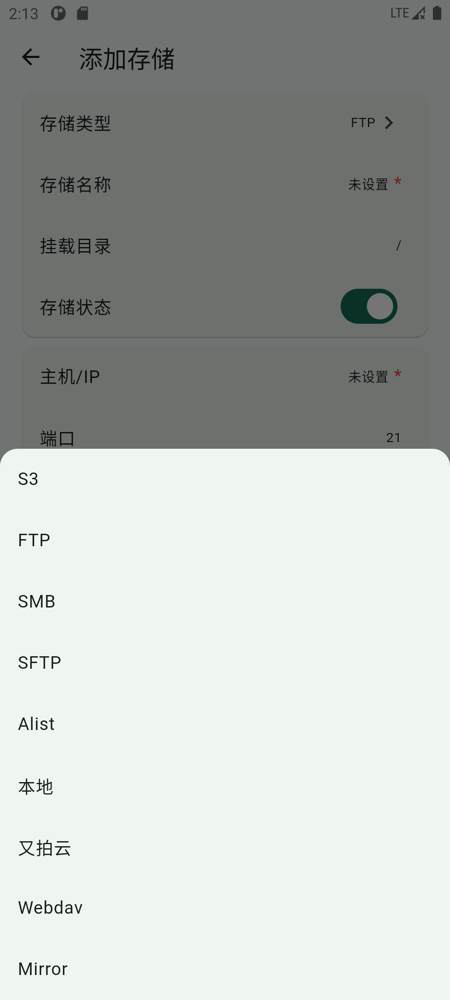
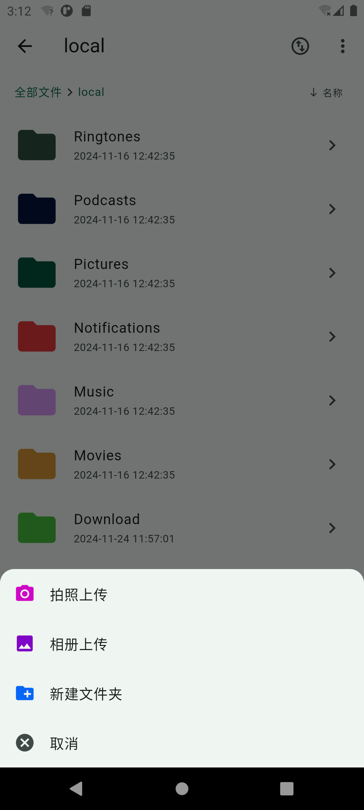
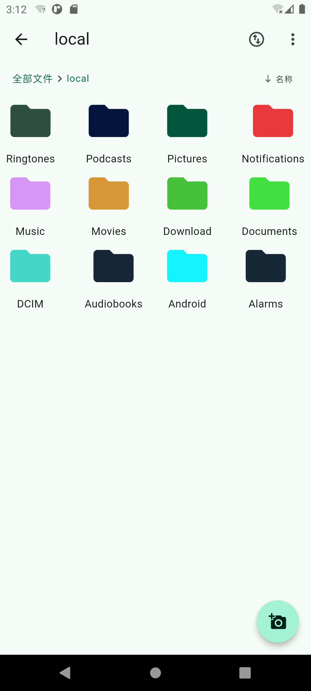
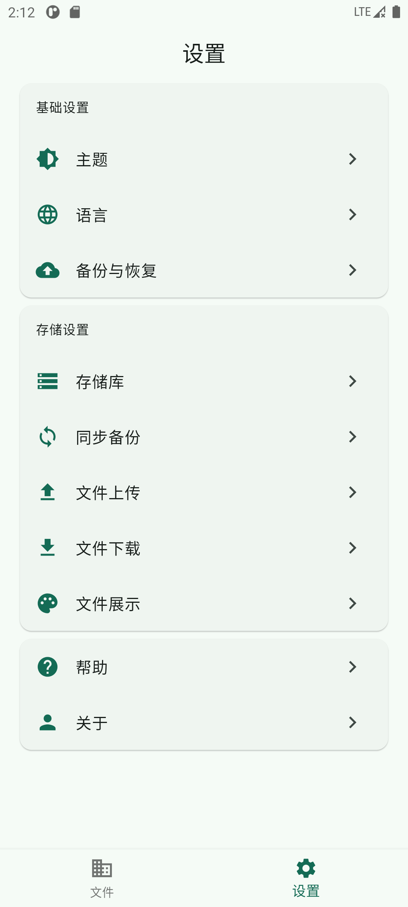
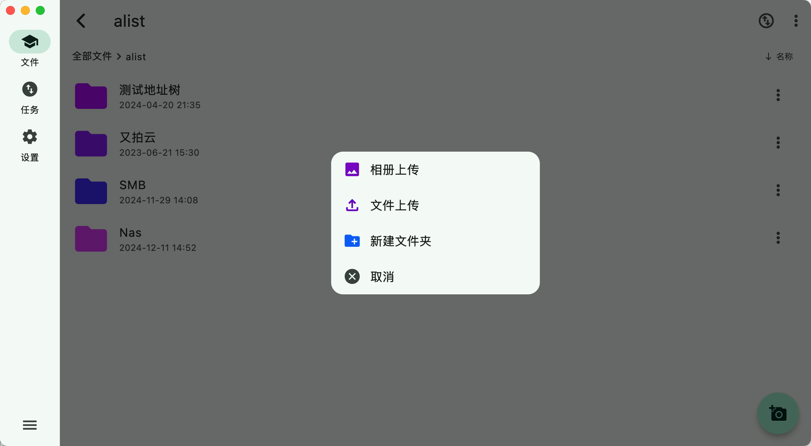
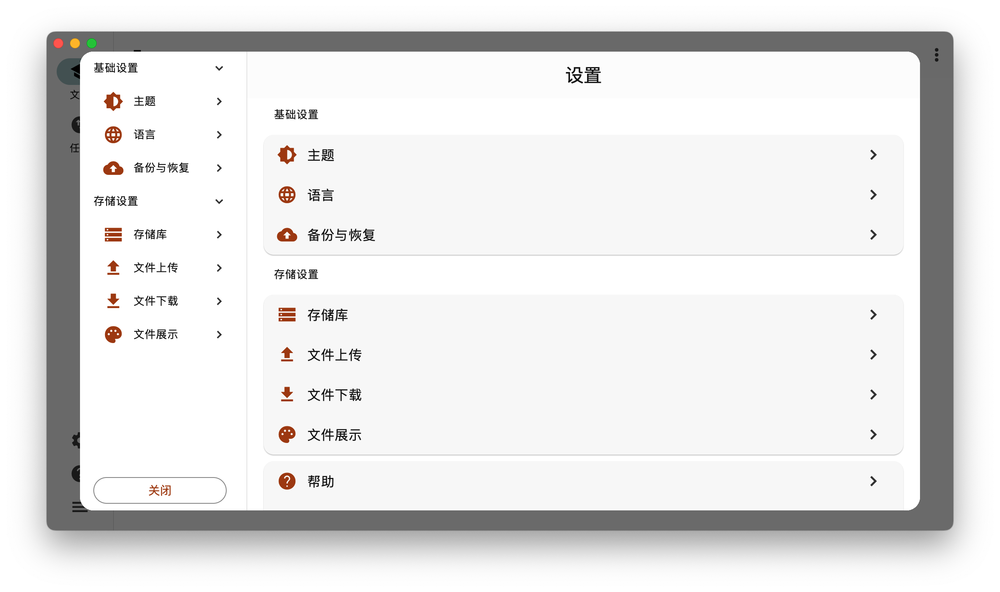

  
  <h1>红枫云盘</h1>

  
  

 [主页][home] | [下载][download] | [帮助文档][document]

[home]: https://fileapp.honmaple.com
[document]: https://fileapp.honmaple.com/guide/introduction.html
[download]: https://github.com/honmaple/maple-file/releases/tag/v1.0.5

> 使用 **Flutter** 实现的无服务端多协议云盘文件上传和管理APP

## 支持的存储
   - [X] 本地文件
   - [X] FTP
   - [X] SFTP
   - [X] S3
   - [X] SMB
   - [X] Webdav
   - [X] Alist
   - [X] Mirror(镜像站，支持文件查看和下载，支持格式：清华源、阿里源或者其他 **nginx** 文件列表源)
   - [X] 又拍云

## 功能
   - 支持文件列表查看/复制/移动/删除/重命名/上传/下载
   - 支持桌面端拖拽上传(文件或者文件夹)
   - 支持文件多选及操作
   - 支持文件列表信息缓存
   - 支持回收站
   - 支持视频、音频、图片和文本文件的预览
   - 支持文件加密和压缩
   - 支持各存储之间的备份和同步(**测试中**)
   - 支持多语言(中文、英文)
   - 支持 **Web**, **Android**, **MacOS** 和 **Windows**

## 截图
<table rules="none">
  <tr>
    <td></td>
    <td></td>
  </tr>
   <tr>
    <td></td>
    <td></td>
  </tr>
   <tr>
    <td></td>
  </tr>
   <tr>
    <td></td>
    <td></td>
  </tr>
</table>
